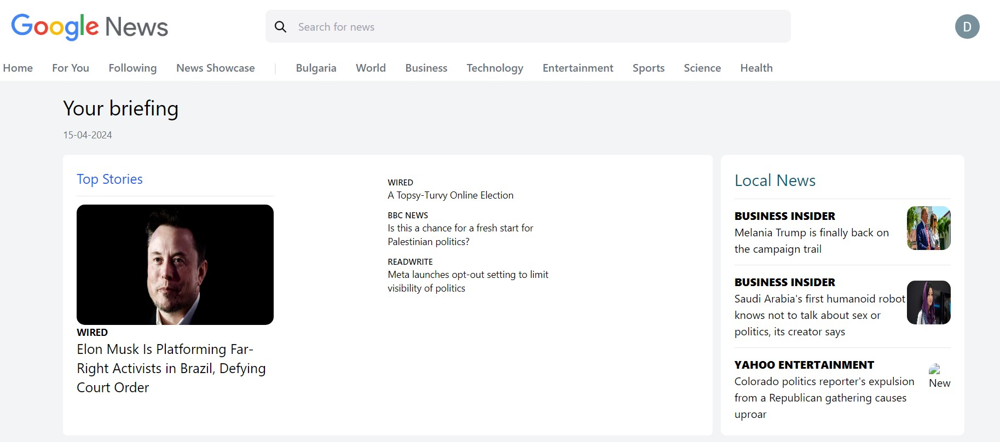
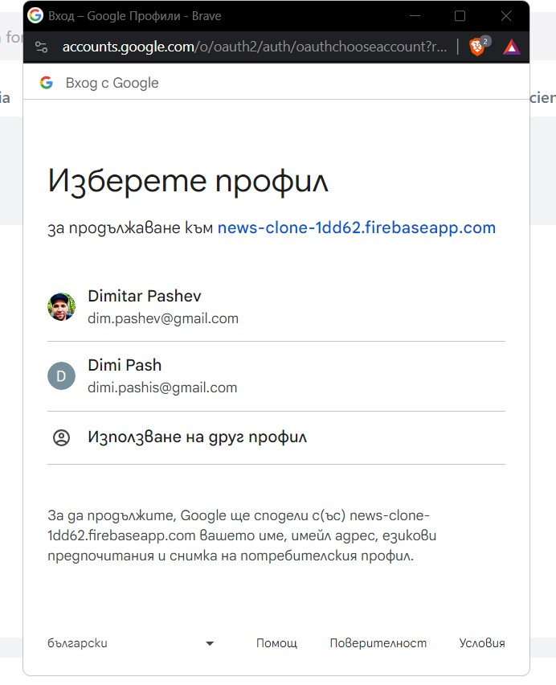
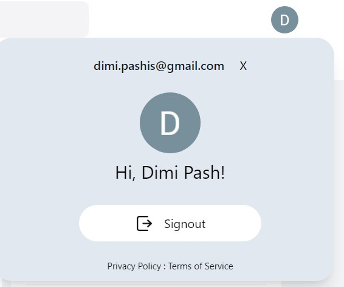

# Google News Clone

This is a completed React-based application that replicates the core functionality of the Google News platform. It was built using Vite, TypeScript, Tailwind CSS, and Firebase.

## Features

- Fetch news articles from various sources using the NewsAPI
- Display news articles in a grid-like layout
- Allow users to filter news by category (e.g., technology, sports, politics)
- Implement a search functionality to find specific news articles
- Provide a detailed view for each news article, including the full content, author, and publication date
- Utilize Firebase for user authentication, allowing users to save their favorite articles

## Screenshots

Here are some screenshots of the Google News Clone application:

**Home Page**



**Google Login**



**Logged In**



## Technologies Used

- React.js
- Vite (for project setup and development)
- TypeScript (for type safety and better code organization)
- Tailwind CSS (for responsive and customizable styling)
- Firebase (for user authentication and data storage)
- NewsAPI (for fetching news articles)

## Project Setup

1. Clone the repository:
```bash
git clone https://github.com/dimipash/Google-News-Clone-ReactJS.git
```

2. Navigate to the project directory:
```bash
cd google-news-clone
```

3. Install dependencies:
```bash
npm install
```

4. Set up Firebase:
   - Create a new Firebase project on the Firebase Console.
   - Enable the necessary authentication and Firestore services.
   - Copy the Firebase configuration details and update the `src/firebase.ts` file.

5. Start the development server:
```bash
npm run dev
```

6. Open your web browser and visit `http://localhost:5173` to see the application.
